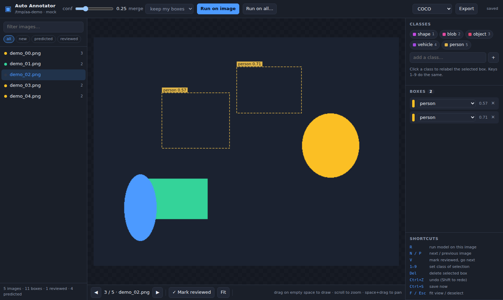

# Auto Annotator

Label an image folder with a model that runs **on your machine**, then fix what the
model got wrong in a browser GUI. Nothing is uploaded anywhere: inference, the
images and the annotations all stay local.



## Install

```bash
pip install -e .            # core: FastAPI, Pillow, numpy
pip install -e ".[onnx]"    # + onnxruntime, for YOLO .onnx models
pip install -e ".[dev]"     # + pytest, for the test suite
```

Every `auto-annotator ...` command below also works as
`python -m auto_annotator ...`, which needs nothing on your PATH.

### "auto-annotator is not recognised"

PowerShell, cmd or a shell saying the command is not found means `pip` put the
launcher in a `Scripts`/`bin` directory that is not on your PATH — a common
result of `pip install --user`, or of installing into a virtualenv that is not
activated. The module form always works:

```powershell
py -m pip install -e .          # from the repo root; installs the package
py -m auto_annotator demo       # ...and this needs no PATH entry at all
```

If you would rather have the short command, use a virtualenv and activate it,
which puts `auto-annotator` on PATH for that shell:

```powershell
py -m venv .venv
.venv\Scripts\Activate.ps1      # cmd: .venv\Scripts\activate.bat
pip install -e .
auto-annotator demo
```

On Windows the tool is otherwise unremarkable: the GUI is a browser page, and
the one place that needs care is the YOLO export, which symlinks images by
default and falls back to copying automatically when Windows refuses (symlinks
need Developer Mode or an elevated shell). Pass `--image-mode copy` to skip the
attempt.

## Try it in 30 seconds

```bash
auto-annotator demo         # makes sample images and opens the GUI on :8000
python -m auto_annotator demo   # same thing, no PATH needed
```

That runs the `mock` backend, which invents deterministic boxes — enough to see
how review works without downloading weights.

## Real work

```bash
# 1. pre-label a folder (no GUI, good for large batches)
auto-annotator annotate ./images --model onnx:yolov8n.onnx --conf 0.3

# 2. correct the labels in the browser
auto-annotator serve ./images --model onnx:yolov8n.onnx --open

# 3. hand the dataset to a trainer
auto-annotator export ./images --format yolo -o ./dataset
```

`serve` alone is enough — the GUI can run the model per image or across the whole
folder — but pre-labelling first means every image already has boxes when you
start reviewing.

### Getting a model

| Backend | Install | Use |
| --- | --- | --- |
| `onnx` | `pip install onnxruntime` | `--model onnx:yolov8n.onnx` |
| `openvino` | `pip install openvino` | `--model openvino:yolo11n_openvino_model` |
| `ultralytics` | `pip install ultralytics` | `--model ultralytics:yolov8n.pt` |
| `torchvision` | `pip install torch torchvision` | `--model torchvision:fasterrcnn_resnet50_fpn` |
| `mock` | — | `--model mock` |

`auto-annotator backends` prints the same list, marks which ones are installed,
and names the OpenVINO devices this machine actually has. A YOLO `.onnx` file
comes from ultralytics:

```bash
yolo export model=yolov8n.pt format=onnx     # writes yolov8n.onnx
```

The ONNX backend reads YOLOv5/v7 and YOLOv8/v11 exports, takes class names from
the file's metadata when they are there, and otherwise assumes COCO. For a custom
model, pass the names in model order:

```bash
auto-annotator serve ./images --model onnx:parts.onnx --labels bolt,nut,washer
```

If the name count does not match what the model predicts, boxes come back as
`class_0`, `class_1`, … rather than quietly wearing the wrong names.

### OpenVINO

For Intel CPUs, integrated GPUs and NPUs, the `openvino` backend is usually the
fastest option on the same hardware:

```bash
pip install openvino
yolo export model=yolo11n.pt format=openvino      # writes yolo11n_openvino_model/

auto-annotator serve ./images --model openvino:yolo11n_openvino_model
auto-annotator serve ./images --model openvino:yolo11n_openvino_model --device GPU
```

Point it at the export directory, the `.xml` inside it, or an ONNX file —
OpenVINO reads all three, so no conversion step is needed for a model you
already have as ONNX. Class names are picked up from the export's
`metadata.yaml` (or the IR's runtime info) when it has them, so `--labels` is
only needed for models that carry none.

`--device` takes `CPU`, `GPU`, `NPU`, `AUTO` (the default, which picks for you)
or any other OpenVINO device string; `auto-annotator backends` lists what is
present. Paths ending in `.xml` or `_openvino_model` are recognised without the
`openvino:` prefix.

Note that `yolo export format=openvino` compresses weights to FP16 by default,
which moves scores slightly versus the same model in ONNX — enough to matter if
you are comparing runs at a fixed confidence threshold, not enough to change
what gets detected.

## The GUI

* **Draw** — drag on empty space. **Move** — drag inside a box. **Resize** — drag a handle.
* **Relabel** — click a class pill, pick from the row's dropdown, or press `1`–`9`.
* **Run the model** — `Run on image` (`R`) for one, `Run on all…` for the folder,
  with a progress dialog you can cancel.
* **Confidence** and **merge mode** in the toolbar decide what a run does with
  boxes that are already there:
  * `keep my boxes` — replace old predictions, keep anything you drew or edited
  * `replace all` — start over from the model's output
  * `append` — add to what is there
* **Nudge** — arrow keys move the selected box a pixel at a time, `Shift`+arrows
  resize it. This is the way to adjust a box whose handles sit off-screen or
  under other boxes, which happens a lot with dense predictions.
* **Review flow** — `V` marks the image reviewed and jumps to the next one.
  Reviewed images are skipped by `Run on all…`, so a second pass only touches
  what you have not checked.

Boxes are dashed while they are the model's and solid once you have touched them;
the dots in the image list are grey (new), amber (predicted) and green (reviewed).

The cursor tells you what a drag will do: a resize arrow over a handle, a move
cursor inside a box, a crosshair where a drag would draw a new one. The box under
the cursor is highlighted, on the canvas and in the list.

Everything saves itself half a second after you stop editing — `Ctrl+S` forces it,
`Ctrl+Z` / `Ctrl+Shift+Z` undo and redo, scroll zooms, space-drag pans, `F` fits.

### Rearranging the panels

Drag the bar between any two panes to resize them — the sidebars, and the
Classes/Boxes/Shortcuts panels within the right one. Click a panel's heading to
collapse it; collapsing Shortcuts once you know them gives the box list the whole
sidebar. Sizes and collapsed panels are remembered in your browser.

## Where annotations live

Next to your images, in a sidecar folder — the images themselves are never
touched or moved:

```
images/
  cat.jpg
  .auto-annotator/
    project.json                # class list and settings
    annotations/cat.json        # one file per image
    exports/                    # whatever you export
```

Boxes are stored normalized (0–1), so resizing or re-encoding an image later does
not invalidate its labels. One file per image means an interrupted save can cost
at most one image's work.

## Export formats

`coco`, `yolo`, `voc` and `csv`:

```bash
auto-annotator export ./images -f coco          # .auto-annotator/exports/annotations.coco.json
auto-annotator export ./images -f yolo -o ./ds  # a dataset you can train on directly
auto-annotator export ./images -f csv --include-empty
```

Exports carry the score and whether each box came from the model or a human, so
you can audit or filter later.

### YOLO export

The `yolo` export is the format YOLOv5, v8 and v11 all read — `class_id cx cy w h`,
normalized — in the directory layout the trainer resolves, where labels mirror
images path-for-path:

```
ds/
  images/train/cat.jpg     labels/train/cat.txt
  images/val/dog.jpg       labels/val/dog.txt
  data.yaml                classes.txt
```

```bash
auto-annotator export ./images -f yolo -o ./ds --val-split 0.2
yolo detect train data=./ds/data.yaml model=yolo11n.pt
```

Images are symlinked into the dataset so nothing is duplicated; pass
`--image-mode copy` if the dataset has to be moved or zipped, or
`--image-mode none` for labels only. `--val-split` holds back a deterministic
fraction, so re-exporting after more labelling never reshuffles your split.
Nested images are flattened (`nested/c.png` → `nested__c.png`) to fit YOLO's
flat layout, and `data.yaml` points at the export directory, not your source
folder.

## Commands

```
auto-annotator serve    <images> [--model SPEC] [--conf F] [--classes ...] [--labels ...]
                                 [--device DEV] [--port N] [--open]
auto-annotator annotate <images> [--model SPEC] [--conf F] [--merge MODE] [--all] [--only-new]
                                 [--labels ...] [--device DEV]
auto-annotator export   <images> [-f coco|yolo|voc|csv] [-o PATH] [--include-empty]
                                 [--val-split F] [--image-mode link|copy|none]
auto-annotator stats    <images>
auto-annotator backends
auto-annotator demo     [--dir D] [--count N]
```

## Adding a backend

Subclass `Detector`, return normalized boxes, register the class. (For another
YOLO runtime, subclass `YoloRuntime` from `inference.yolo_common` instead and
implement just `load` and `_infer` — letterboxing, decoding both output layouts
and NMS come for free, which is all the `openvino` backend is.)

```python
# my_backend.py
from auto_annotator.inference.base import Detector
from auto_annotator.schema import Box, Detection

class MyDetector(Detector):
    kind = "mine"

    def load(self):
        self.model = ...            # called once, lazily
        self._loaded = True

    def _predict(self, image_path, conf):
        return [Detection("widget", Box(0.1, 0.1, 0.4, 0.4), 0.9)]
```

```python
from auto_annotator.inference import BACKENDS
BACKENDS["mine"] = "my_backend:MyDetector"
```

Anything with a `predict(path, conf)` returning `Detection`s also works directly:

```python
from auto_annotator.engine import Annotator
from auto_annotator.store import Project

project = Project("./images")
Annotator(project, detector=MyDetector()).annotate_all()
```

## HTTP API

The GUI is a client of a small JSON API on the same port, so scripts can drive it too:

| Method | Path | Does |
| --- | --- | --- |
| `GET` | `/api/project` | classes, stats, model, image list |
| `GET` | `/api/images/{path}` | one image with its annotations |
| `PUT` | `/api/images/{path}/annotations` | replace an image's annotations |
| `POST` | `/api/images/{path}/predict` | run the model on one image |
| `POST` | `/api/jobs/predict` | start a folder-wide run (poll `/api/jobs/{id}`) |
| `PUT` | `/api/model` | swap model or threshold while serving |
| `POST` | `/api/export` | write an export |

## Tests

```bash
pytest                                        # unit, API and runtime tests
pip install playwright && playwright install chromium
pytest tests/test_gui.py                      # drives the GUI in a real browser
```

The browser tests cover what the others cannot see: that a long box list scrolls
inside its panel instead of covering the panel below (where it would swallow the
clicks meant for those rows), that predicted boxes can be selected and edited,
and that the cursor advertises what a drag will do. They skip themselves if no
chromium is installed.

The suite covers the store, merge policies, exporters and the HTTP API. The ONNX
and OpenVINO backends are run for real — a synthetic YOLO graph is built,
compiled and executed by each runtime — so the letterboxing and coordinate maths
are checked without downloading weights, including a test that both runtimes
return the same detections for the same model. Tests for a runtime you have not
installed skip themselves.
